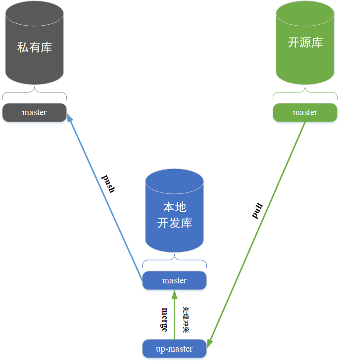

最近在学习过程中有个需求，就是需要以github上的一个开源项目为起点，在这个开源项目的基础上开发自己的私有项目，并需要把私有项目提交到自己建立的私有库中进行备份。
因为开源库还在不停的更新新功能，所以在开发自己的私有项目的过程中就需要经常把开源库新增的功能也同步到私有库中。

总结一下，就是需要从一个开源库拉取代码，合并到自己的本地开发库中，在本地开发库上进行开发，新开发的内容提交到自己的私有库中。
不断的重复这个过程，实现把开源库新更新的功能和本地开发库中开发的代码都推送进自己的私有库的目的。

<div align=center></div>


整个逻辑如上图所示，为了简化问题的表述，我们假设只从开源库的master分支拉取源代码。
私有库只有一个master分支，本地开发库有两个分支，分别是master和up-masher。
本地开发库的master和up-master分支分别绑定远端私有库和开源库的master分支。

# 实现步骤：

## 0. 环境描述
```shell
[root@localhost ~]# git version
git version 2.36.6
```
centos7系统默认安装的git版本是1.8.3，下面部署过程中会有点小问题，建议git版本过低的话，先升级一下。

## 1. github上新建私有库
在自己的github上新建一个私有仓库。

## 2. 本地初始化git项目
```shell
[root@localhost ~]# mkdir project_dir
[root@localhost ~]# cd project_dir
[root@localhost project_dir]# git init
```

## 3. 添加远程仓库到本地
```shell
// 添加私有仓库，别名为 origin
[root@localhost project_dir]# git remote add origin https://[私有库地址]

// 添加开源仓库，别名为 upstream
[root@localhost project_dir]# git remote add upstream https://[开源库地址]
```

## 4. 在本地开发库中创建master和up-master分支并和远端的master分支绑定
```shell
// 拉取开源库(upstream)的master分支到本地
[root@localhost project_dir]# git fetch upstream master

// 此时本地工作目录是空的, checkout到 upstream/master
[root@localhost project_dir]# git checkout master

// 在本地创建up-master分支并将工作目录切换到此分支
[root@localhost project_dir]# git checkout -b up-master

// 将本地的up-master分支和开源库(upstream)的master分支绑定
[root@localhost project_dir]# git branch -u upstream/master

// 将本地工作目录切换回master分支
[root@localhost project_dir]# git checkout master

// 将本地master分支推送到私有库(origin)
// 即实现本地master分支和origin/master分支的绑定
[root@localhost project_dir]# git push -u origin master
```
通过上面的操作，本地分支和远程分支有了如下的对应关系：

master ===> origin/master

up-master ===> upstream/master

## 5. 定期拉取upstream/master代码后合并到本地master分支
```shell
// 切换到up-master分支
[root@localhost project_dir]# git checkout up-master

// 拉取代码, 注意一定要先切换到up-master分支再拉取代码
[root@localhost project_dir]# git pull upstream master

// 切换到master分支
[root@localhost project_dir]# git checkout master

// 将本地 up-master 分支的代码合并到 master 分支
[root@localhost project_dir]# git merge up-master
```
合并分支的时候如果出现代码冲突，有冲突的文件会被git标红, 通过 git status 命令可以看到未解决冲突的文件列表，
手动解决完这些冲突后再执行 git add . 命令和 git commit -m "message"， git push 进行一次常规的提交即可。

## 6. 生产环境部署
如果想部署自己私有库里面的项目，直接拉取私有库的master分支即可。

## 其他说明
### 二进制文件冲突的解决
文本冲突可以直接编辑解决，如果是二进制文件，比如图片发生冲突的时候，使用以下命令选择保留哪一个文件。
```shell
// 使用 --ours 参数保留当前分支版本的文件
[root@localhost project_dir]# git checkout --ours /path/to/file
​
// 使用 --theirs 参数保留并入分支版本的文件
[root@localhost project_dir]# ​git checkout --theirs /path/to/file
```
### token 认证 
当你把自己开发的代码推送到私有库的时候，可能推不上去,
可能的原因是:
```
remote: Support for password authentication was removed on August 13, 2021. Please use a personal access token instead.
```
从2021年8月13日起，github不再支持账号密码的push方式，你需要在github上设置个人token，然后，
```shell
[root@localhost project_dir]# git remote set-url origin https://[your_token]@github.com/[USERNAME]/[REPO].git
```

另，

取消代理：
```shell
// 取消http代理
[root@localhost project_dir]# git config --global --unset http.proxy

// 取消https代理
[root@localhost project_dir]# git config --global --unset https.proxy
```

# 感谢
知乎ID: 不用上班的程序员
